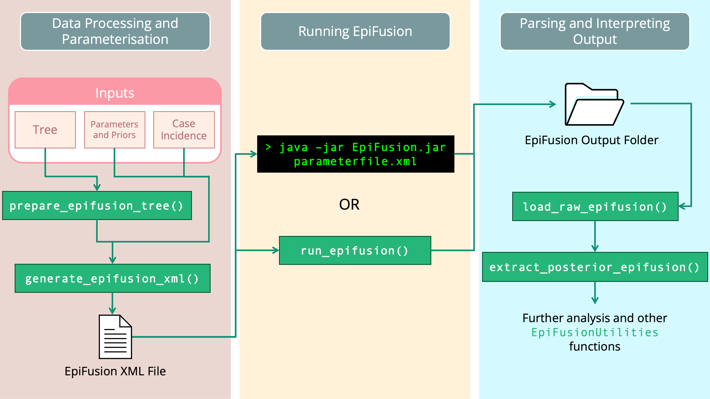
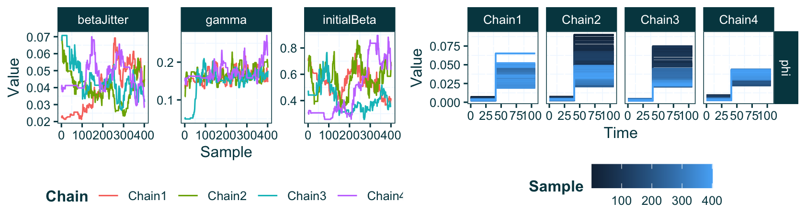

```{r setup, include=FALSE}
knitr::opts_chunk$set(echo = TRUE, dpi = 600, out.width = "100%")
library(tidyverse)
library(dplyr)
library(ape)
library(ggplot2)
library(ggtree)
library(ggpubr)
library(EpiFusionUtilities)
```

```{r lshtm_plotting_theme, echo = F}
lshtm_theme <- function() {
  theme(
    # add border 1)
    panel.border = element_rect(colour = "#01454f", fill = NA, size = 0.5),
    # color background 2)
    panel.background = element_rect(fill = "white"),
    # modify grid 3)
    #panel.grid.major.x = element_line(colour = "steelblue", linetype = 3, size = 0.5),
    panel.grid.minor.x = element_line(colour = "aliceblue"),
    #panel.grid.major.y =  element_line(colour = "steelblue", linetype = 3, size = 0.5),
    panel.grid.minor.y = element_line(colour = "aliceblue"),
    # modify text, axis and colour 4) and 5)
    axis.text = element_text(colour = "#01454f"),
    axis.title = element_text(colour = "#01454f"),
    axis.ticks = element_line(colour = "#01454f"),
    # legend at the bottom 6)
    #legend.position = "bottom"
    strip.text.x = element_text(colour = "white"),
    strip.text.y = element_text(colour = "white"),
    strip.background = element_rect(
      color="#01454f", fill="#01454f", size=1.5, linetype="solid"
    ),
    legend.position = "bottom",
    legend.title = element_text(colour = "#01454f", face = "bold"),
    legend.text = element_text(colour = "#01454f")
  )
}

```

##### Ciara Judge^1,2,5^, Timothy Vaughan^3,4^, Timothy Russell^1,2^, Sam Abbott^1,2^, Louis du Plessis^3,4^, Tanja Stadler^3,4^, \*Oliver Brady^1,2^, \*Sarah Hill^5^

1.  Department of Infectious Disease Epidemiology and Dynamics, Faculty of Epidemiology and Public Health, London School of Hygiene and Tropical Medicine, United Kingdom

2.  Centre for Mathematical Modelling of Infectious Diseases, London School of Hygiene and Tropical Medicine, United Kingdom

3.  Department of Biosystems Science and Engineering, ETH Zurich, Basel, Switzerland

4.  Swiss Institute of Bioinformatics, Lausanne, Switzerland

5.  Department of Pathobiology and Population Sciences, Royal Veterinary College, United Kingdom

\*[ciara.judge\@lshtm.ac.uk](mailto:ciara.judge@lshtm.ac.uk); [sahill\@rvc.ac.uk](mailto:sahill@rvc.ac.uk); [oliver.brady\@lshtm.ac.uk](mailto:oliver.brady@lshtm.ac.uk)

\newpage

## Introduction (for thesis)

In the preceding chapters of this thesis, I devised, validated and implemented a new model for inferring a range of outbreak characteristics (infection trajectories, $R_t$ trajectories, cumulative infection trajectories, etc) conditioned on phylogenetic tree and case incidence data. The model, 'EpiFusion' is packaged as a standalone Java executable software to be distributed for universal use. To improve utility, I also developed an R package 'EpiFusionUtilities' which facilitates convenient preparation of model data, parameters and priors in R and subsequent analysis of results. Further, a stable build of the EpiFusion model is included in the package, allowing the full workflow to be completed within an R session. These softwares comprise the EpiFusion Analysis Framework. For the purposes of reproducibility and open research, in this article I outline instructions on the implementation of the framework and provide a series of three vignettes where I demonstrate approaches to analysing simulated data. This article also details the addition of a new feature for incorporating phylogenetic uncertainty by providing a tree posterior samples from bayesian tree inference (from a program such as BEAST) as the phylogenetic tree data, in place of a fixed tree.

\newpage

## 1. Abstract

The fields of epidemiology and viral phylodynamics share the ultimate goal of disease control, but concepts, methodologies and data employed by each differ in ways that confer complementary strengths and different areas of weakness. We recently introduced EpiFusion, a model for joint inference of outbreak characteristics using phylogenetic and case incidence data via particle filtering, and demonstrated its usage to infer the effective reproduction number of simulated and real outbreaks. Here we provide a series of vignettes demonstrating data analysis using the EpiFusion Analysis Framework, consisting of the R package EpiFusionUtilities and the java program in which the model is implemented, including an example using a new feature incorporated since EpiFusion's last description: the option to provide a phylogenetic tree posterior as the phylogenetic data input to the program. By outlining these use cases we aim to improve the usability and accessibility of our model, and promote workflow reproducibility and open research.

\newpage

## 2. Introduction

Utilising computational tools for the implementation of mathematical models of infectious disease outbreak characteristics is an important aspect of public health research [@jenner2020; @pokutnaya2023]. Modern advances in computation have facilitated the development of many such tools often distributed as packages or libraries in popular programming languages such as R, Python or Julia, or as standalone executable software [@jombart2024; @juliaep; @heslop2017; @epirecip]. Distributing and documenting epidemiological models and workflows is of vital importance for the purposes of reproducible research, and to enable efficient implementation of these models to answer research questions [@henderson2024; @sy2021; @jalali2021]. Previously we outlined EpiFusion, a novel method for modelling infectious disease outbreak characteristics conditioned on case incidence and phylogenetic trees using particle filtering, and validated its usage to infer infection trajectories and the effective reproduction number R(t) [@judge2024]. Here, we present the EpiFusion Analysis Framework, consisting of this EpiFusion model implemented as a Java command line tool, and the EpiFusionUtilities R package for data and output processing.

EpiFusion consists of a single process model, dual observation model particle filtering structure, where particles simulate outbreak trajectories and characteristics through time (process model) and are evaluated against phylodynamic and epidemiological data at resampling steps (observation model). EpiFusion uses case incidence and phylogenetic tree(s) as its data input, but can also be run with either data type alone (however, for the purposes of this article we focus on examples where we use both data types together). The force of infection over time $\beta$ is fit within the particle filter, and the recovery rate, case sampling rate, and genomic sequence sampling rate ( $\gamma$ , $\phi$ and $\psi$ respectively) are fit via MCMC. Further information including model theory and validation are provided in [@judge2024].

The EpiFusion model is packaged as a Java [@javapro] command line tool and takes eXtensible Markup Language (XML) files [@lupp2008] as input. However, the recommended workflow for implementation includes data pre-processing, parameterisation, and eventual output parsing from within an R session, using the R package EpiFusionUtilities (<https://github.com/ciarajudge/EpiFusionUtilities>). It is also possible to call the EpiFusion executable from within R using the same package. Here we outline the EpiFusion Analysis Framework and demonstrate start-to-finish use cases for complete analysis of two outbreak datasets using EpiFusion and EpiFusionUtilities.


## 3. Methods

### Operation

EpiFusion is implemented as an open-source Java software (version 8 or later) and can be used as a command line tool or from within the EpiFusionUtilities R package. The latest stable version of the program is available for download under `Releases` on the project Github repository (<https://github.com/ciarajudge/EpiFusion/releases>). The source code for the latest development version is also available at this repository for users who wish to clone the repository and compile the program from source. EpiFusion can be called using its full file path, or from any working directory on your system by creating a symbolic link *(Appendix 1)*.

EpiFusionUtilities is implemented as an open source R (version 3.5.0 or later) package and is available to install from Github using the R package devtools [@wickham2022]:

```{r install_epifusionutilities_example, eval = F}
# install from Github
devtools::install_github("https://github.com/ciarajudge/EpiFusionUtilities")
```

The recommended EpiFusion workflow includes data processing and parameterisation in R using `EpiFusionUtilities`, followed by running from the `EpiFusionUtilities` function `run_epifusion()` or by calling EpiFusion directly from the command line, and finally, parsing the results from output files into familiar R objects using the `EpiFusionUtilities` functions `load_raw_epifusion()` and `extract_posterior_epifusion()`. The key steps of the EpiFusion Framework workflow are outlined below in brief in the 'Implementation' section.

### Implementation

The EpiFusion Analysis Framework consists of three main steps: (i) Data Processing and Parameterisation (ii) Running EpiFusion and (iii) Parsing and Interpreting the output (*Figure 1*). All three steps can be carried out using `EpiFusionUtilities`, but it is also possible to manually assemble an XML input file and run `EpiFusion` from the command line using an executable jar file, which may be preferable in some circumstances (e.g. if using a remote system such as a high performance computing cluster).

```{r, echo=FALSE, fig.cap = "Figure 1 Recommended EpiFusion Framework workflow, using EpiFusionUtilities functions (green) to prepare data and parse results."}

```

#### Data Processing and Parameterisation

##### EpiFusion XML

EpiFusion uses input files written in eXtensible Markup Language (XML) to provide all data and parameterisation to the program. These files contain `Loggers`, `Data`, `Analysis`, `Model`, `Parameters` and `Priors` sections where various aspects of the model and analysis may be specified *(Table 1)*. A full breakdown of the options available within each section is included in the Supplementary Information *(Appendix 2)*.

| EpiFusion XML Section | Description                                                                                                                                                                                                                                                                                         |
|--------------------------|----------------------------------------------|
| Loggers               | Provides detail on the program output, including specifying the file path of the output folder that should be created, and the frequency at which the program both logs the state of the MCMC to the output files and prints to the console.                                                        |
| Data                  | Provides the case incidence data and/or a phylogenetic tree or trees. These can be supplied either directly within the XML document or by providing full file paths to files containing the data)                                                                                                   |
| Analysis              | Parameterises the method for fitting beta, the force of infection                                                                                                                                                                                                                                   |
| Model                 | Allows further customisation of the EpiFusion model structure - currently only specification of the epidemiological observation model is available                                                                                                                                                  |
| Parameters            | Specifies many assorted parameters for the model, for example number of MCMC steps per chain, number of MCMC chains, number of particles in the particle filter etc.                                                                                                                                |
| Priors                | Prior distribution specification for parameters to be fit via particle MCMC. A range of distribution options are available, including: Normal, Truncated Normal, Poisson, Uniform, Uniform Discrete, Beta and Fixed (if a parameter should be fixed to a specific value and not inferred via MCMC). |

: Table 1 Main sections of EpiFusion XML parameter file structure

##### Assembling parameter XML files

EpiFusion XML files may either be populated manually using the many templates available at the `EpiFusion` Github repository under `examples`, or created using a number of useful functions in the `EpiFusionUtilities` package.

The first step of processing case incidence or tree data for EpiFusion input is to select an 'index date'. The index date is the approximate date of origin of the outbreak (i.e. day '0') and should be before any birth events in the tree or observed epidemiological cases. This date is provided to the processing functions to enable the case and incidence data to be rooted in numerical time units, all trajectory samples will assume that the outbreak originated with one individual becoming infected on the index date. All times in the EpiFusion input and output will be in relation to this date and measured in days.

```{r set_index_date_example, eval = F}
index_date <- as.Date("2024-01-01")
```

If there is uncertainty in the date of origin of the outbreak we recommend arbitrarily setting the index date to earlier than the estimated date of origin. The resulting trajectories will likely demonstrate high uncertainty and low prevalence during the earliest days of the outbreak, until the point of the time series at which some data becomes available.

To prepare a tree or posterior set of trees for EpiFusion, pass an S3 phylo or multiPhylo object in R to the `prepare_epifusion_tree()` function (we recommend any standard phylogenetics R package to read in or generate these [@paradis2019; @schliep2011]). This function processes a phylogenetic tree (or trees) and writes to a file, which you can specify in the arguments of the function (the default is './processedtree.tree'). It is also necessary to pass the date of the last sample in the tree(s). This function adds node and leaf labels to the tree string that correspond to their time in days after the index date.

```{r processing_tree_example, eval = F}
prepare_epifusion_tree(tree,
                       index_date,
                       last_sequence_date,
                       "Data/Processed/processed_fixed_tree.tree")
```

To generate an EpiFusion XML file from within an R session, the `generate_epifusion_XML()` function may be used. This function populates a template XML file (included with the `EpiFusionUtilities` package) with the phylogenetic and/or case incidence data, and has default settings for parameters and priors which can also be changed by providing new values in the arguments of the function. For example below, we pass a case incidence data frame and tree to the function, specify that we will sample from the MCMC chain every 100 steps, set our output folder path to `output_files`, and adjust the number of particles in the particle filter to 300. This creates a file in our working directory, `epifusion_input.xml`, which is ready to pass to EpiFusion.

```{r generate_xml_example, eval = F}
logger_information <- list(fileBase = "output_files", logEvery = 100)
parameters_to_adjust <- list(numParticles = 300)

generate_epifusion_XML(tree = "Data/Processed/processed_fixed_tree.tree",
                       case_incidence = case_incidence,
                       index_date = index_date,
                       loggers = logger_information,
                       parameters = parameters_to_adjust,
                       xml_filepath = "epifusion_input.xml")

```

#### Running EpiFusion

EpiFusion can be run directly from the command line by calling an executable Java Archive (JAR) file using the following syntax. Here `EpiFusion.jar` is the file path to the executable file (i.e. in this example, the file is present in the working directory) and `epifusion_input.xml` is the file path to the parameter XML file (also present in the working directory for this example):

``` sh
java -jar EpiFusion.jar epifusion_input.xml
```

Alternatively, it is possible to run EpiFusion from inside an R session with the EpiFusionUtilities function `run_epifusion()`. An installation of Java is still required.

```{r run_epifusion_example, eval = F}
run_epifusion("epifusion_input.xml")
```

#### Interpreting Output

EpiFusion creates a directory within the working directory that corresponds to the file path of the `fileBase` parameter in your EpiFusion xml file. For each MCMC chain, EpiFusion will create the following output files:

-   **betas**: .csv file where each row is a daily trajectory of the force of infection over time $\beta$ sampled from the MCMC

-   **trajectories:** .csv file where each row is a daily trajectory sampled from the MCMC of the number of individuals infected over time

-   **params:** .txt file where each column is an MCMC parameter, and each row is an MCMC sample

-   **likelihoods:** .txt file of the posterior likelihoods calculated at each MCMC step

-   **acceptance:** .txt file where each line logs the acceptance rate of steps between MCMC samples

-   **completed:** .txt file where each line logs if the particle filter step was completed or quit due to particle depletion

-   **cuminfections:** .txt file where each row is a trajectory of cumulative infections per day sampled from the MCMC

-   **positivetests (only for combined or epi-only analyses):** .csv file where each row is simulated case incidence by the model which was compared to the observed case incidence

EpiFusion will also save a copy of the parameter file used to the output folder, to record which parameters were used, and a file called 'timings.txt' with the runtime in nanoseconds.

It is possible to process this raw output manually, but `EpiFusionUtilities` provides a number of functions to do this from within R. The following functions load the raw output into an R object, plot the likelihood trace for each MCMC chain to enable inspection to decide what proportion of samples from each chain to discard as burn-in, and finally extract the posterior samples from each chain and combine them into a single posterior while assessing convergence.

```{r parse_output_example, eval = F}
raw_output <- load_raw_epifusion("output_files/")
plot_likelihood_trace(raw_output)
full_posterior <- extract_posterior_epifusion(raw_output, 0.1)
```

Below we demonstrate the implementation of this workflow using the `EpiFusion` executable and `EpiFusionUtilities` to analyse data from a small simulated outbreak.

\newpage

## 4. Use Cases

### Description of the simulated datasets

In this article we demonstrate three analyses on two simulated outbreak datasets (*Figure 2, 3*). First we address a simple 'baseline' outbreak of length approximately three months with constant sampling consisting of a single epidemic peak. In 'Full Framework Workflow' we will model this outbreak using case incidence data in conjunction with a fixed time-scaled phylogenetic tree. Next, in 'Phylogenetic Uncertainty' we will model the same outbreak while incorporating phylogenetic uncertainty by using a tree posterior generated using a BEAST analysis of genomic samples simulated from the outbreak. Finally, in 'Introducing Rate Changes', we examine an outbreak with similar transmission dynamics but initial minimal sampling of cases and sequences followed by a sharp increase in the sampling rate, and demonstrate how to parameterise this in an EpiFusion model.

To generate the data, outbreak trajectories, and resulting weekly case incidence and a transmission tree of cases were simulated using ReMaster [@vaughan2023]. The transmission trees were downsampled to give a simulated phylogenetic tree of 'sequenced samples' from the outbreak, and for the baseline outbreak genomic sequences were simulated in R from this phylogenetic tree using the function `simSeq()` from the R package `phangorn`[@schliep2011]. These sequences were used to generate a tree posterior using `BEAST 2.7.3` [@bouckaert2019] with a Birth Death Skyline model [@stadler2013], under a strict clock and JC69 substitution model.

The date of origin of each outbreak was arbitrarily chosen as January 1st 2024 and the case data and tree leaves were labelled accordingly. The final resulting data inputs for analysis in EpiFusion consisted of a file with a fixed time-scaled phylogenetic tree, a tree posterior file generated from sequences simulated from the outbreak, and a csv file with dated counts of weekly incidence. These raw data files are provided in the article repository (<https://github.com/ciarajudge/EpiFusion_Vignettes>), where the code below is provided to fully replicate this use case example. The data is also provided directly as part of the `EpiFusionUtilities` package, and can be loaded directly into R using the functions `baseline_dataset` and `sampling_dataset`.

```{r plot_data, echo = F, fig.height = 5, fig.cap = "Figure 2 Data from the baseline outbreak simulated using ReMaster and BEAST 2.7.3. The dataset contains both a fixed phylogenetic tree (top) and tree posterior samples (middle), and weekly case incidence (orange)."}
case_incidence <- read.csv("Data/Raw/weekly_incidence.csv") %>%
  mutate(Date = as.Date(Date))
fixed_tree <- read.tree("Data/Raw/fixed_tree.tree")
tree_posterior <- sample(read.nexus("Data/Raw/tree_posterior.trees")[2000:10000], 200) # Discard burn in, randomly sample 200

tree_plotlims <- lubridate::decimal_date(as.Date(c("2023-12-24","2024-04-15"), format = "%Y-%m-%d"))

fixed_tree_plot <- ggtree(fixed_tree, mrsd = "2024-03-10", color = "darkslateblue") +
  xlim_tree(tree_plotlims) +
  geom_tippoint(col = "darkslateblue") +
  lshtm_theme()

posterior_tree_plot <- ggdensitree(tree_posterior, color = "darkslateblue", alpha = 0.02) +
  xlim(-0.2149453, 0.104) +
  geom_tippoint(col = "darkslateblue") +
  lshtm_theme()

case_incidence_plot <- ggplot(case_incidence, aes(x = Date, y = Cases)) +
  geom_point(col = "orangered3") +
  coord_cartesian(xlim = as.Date(c("2023-12-24", "2024-04-15"))) +
  lshtm_theme()

ggarrange(fixed_tree_plot, posterior_tree_plot, case_incidence_plot, ncol = 1, align = "v")
```

```{r plot_data_2, echo = F, fig.cap = "Figure 3 Data from outbreak with a step-change increase in sampling simulated using ReMaster. The dataset contains a fixed time-scaled phylogenetic tree and weekly case incidence. In this simulation, sampling of both epidemiological cases and genomic sequences was increased on February 5th."}
sampling_case_incidence <- read.csv("Data/Raw/sampling_weekly_incidence.csv") %>%
  mutate(Date = as.Date(Date))
sampling_fixed_tree <- read.tree("Data/Raw/sampling_fixed_tree.tree")

tree_plotlims <- lubridate::decimal_date(as.Date(c("2023-12-24","2024-04-08"), format = "%Y-%m-%d"))

sampling_fixed_tree_plot <- ggtree(sampling_fixed_tree, mrsd = "2024-03-17", color = "darkslateblue") +
  xlim_tree(tree_plotlims) +
  geom_tippoint(col = "darkslateblue") +
  lshtm_theme()

sampling_case_incidence_plot <- ggplot(sampling_case_incidence, aes(x = Date, y = Cases)) +
  geom_point(col = "orangered3") +
  coord_cartesian(xlim = as.Date(c("2023-12-24", "2024-04-08"))) +
  lshtm_theme()

ggarrange(sampling_fixed_tree_plot, sampling_case_incidence_plot, ncol = 1, align = "v")
```

### Full Framework Workflow

In this example, we will use the baseline dataset to show a full workflow using the EpiFusion Framework: (i) data preparation (ii) prior and parameter specification (iii) running EpiFusion (iv) parsing and plotting output.

#### Data Preparation

First we load and inspect the data for this example using the `EpiFusionUtilities` function `baseline_dataset()`. This function loads a data frame with weekly case incidence (formatted with two columns, `Cases` and `Date`), a fixed time-scaled phylogenetic tree of samples, and samples from a tree posterior (with burn-in removed) from a BEAST analysis which we will use in a later section (Phylogenetic Uncertainty).

```{r load_data}
baseline_dataset()

print(baseline_caseincidence[1:5,])

print(baseline_tree)

print(baseline_treeposterior)
```

Next we set two date objects: the 'index date', or the earliest date from which we will model the outbreak origin date, and the date of sampling of the last observed sequence from the dataset. Whilst for this example we know (through the simulation process) that the outbreak origin was the 1st of January 2024, it can be good practice to set the index date to some time before the date that we suspect the outbreak began in the location represented by our case and phylogenetic data, to ensure the dynamics of full outbreak are captured.

```{r set_index_date}
index_date <- as.Date("2023-12-26")
last_sequence <- as.Date("2024-03-10")
```

To prepare the tree objects for EpiFusion we can use the `prepare_epifusion_tree` function from `EpiFusionUtilities`. This function processes the tree(s) for input to EpiFusion and writes them to the provided file path. In the case where a single fixed tree (our first example) is provided to this function it also returns the processed tree as an R phylo object, which here we reassign to the variable `fixed_tree`.

```{r prep_data, eval = F}
fixed_tree <- prepare_epifusion_tree(baseline_tree, index_date, last_sequence, "Data/Processed/baseline_fixed_tree.tree")
```

#### Definition of parameters

We will create an EpiFusion XML file using the `generate_epifusion_xml` function from `EpiFusionUtilities`. This function populates the below XML template with our data and creates a new file, and other arguments to this function can adjust parameters from their default value.

```         
<?xml version="1.0" encoding="UTF-8"?>
<EpiFusionInputs>
  <loggers>
    <fileBase>FILESTEM</fileBase>
    <logEvery>10</logEvery>
  </loggers>
  <data>
    <incidence>
      <incidenceVals>INCIDENCE</incidenceVals>
      <incidenceTimes type="exact">INCIDENCETIMES</incidenceTimes>
    </incidence>
    <tree>
      <treePosterior></treePosterior>
    </tree>
    <epicontrib>0.5</epicontrib>
    <changetimes>0</changetimes>
  </data>
  <analysis>
    <type>looseformbeta</type>
    <startTime>null</startTime>
    <endTime>null</endTime>
    <inferTimeOfIntroduction>false</inferTimeOfIntroduction>
  </analysis>
  <model>
    <epiObservationModel>poisson</epiObservationModel>
  </model>
  <parameters>
    <epiOnly>false</epiOnly>
    <phyloOnly>false</phyloOnly>
    <numParticles>200</numParticles>
    <numSteps>2000</numSteps>
    <numThreads>8</numThreads>
    <numChains>4</numChains>
    <stepCoefficient>0.05</stepCoefficient>
    <resampleEvery>7</resampleEvery>
    <segmentedDays>true</segmentedDays>
    <samplingsAsRemovals>1</samplingsAsRemovals>
    <pairedPsi>false</pairedPsi>
  </parameters>
  <priors>
    <gamma>
      <stepchange>false</stepchange>
      <disttype>TruncatedNormal</disttype>
      <mean>0.143</mean>
      <standarddev>0.05</standarddev>
      <lowerbound>0.0</lowerbound>
    </gamma>
    <psi>
      <stepchange>false</stepchange>
      <disttype>TruncatedNormal</disttype>
      <mean>0.001</mean>
      <standarddev>0.0005</standarddev>
      <lowerbound>0.0</lowerbound>
    </psi>
    <phi>
      <stepchange>false</stepchange>
      <disttype>TruncatedNormal</disttype>
      <mean>0.02</mean>
      <standarddev>0.01</standarddev>
      <lowerbound>0.0</lowerbound>
    </phi>
    <initialBeta>
      <stepchange>false</stepchange>
      <disttype>Uniform</disttype>
      <min>0.3</min>
      <max>0.8</max>
    </initialBeta>
    <betaJitter>
      <stepchange>false</stepchange>
      <disttype>Uniform</disttype>
      <min>0.001</min>
      <max>0.05</max>
    </betaJitter>
  </priors>
</EpiFusionInputs>
```

We will generate an EpiFusion XML using the fixed tree we prepared with the `prepare_epifusion_tree` function and our loaded case incidence data. First we will make lists of the various parts of the XML file we wish to override from the default. For example, the below code represents the `loggers` chunk in the default XML that details how often we sample from the MCMC (every 10 MCMC steps):

```         
  <loggers>
    <fileBase>FILESTEM</fileBase>
    <logEvery>10</logEvery>
  </loggers>
```

To override this, we will make a list in R that we will later pass to the `loggers` argument of the `generate_epifusion_xml` function to specify our output folder filepath as `Results/fixed_tree` and sample from the MCMC chain every 5 steps:

```{r assign_loggers, eval = F}
loggers <- list(fileBase = "Results/baseline_fixed_tree", logEvery = 5)
```

We will also slightly adjust the prior for `initialBeta`, or $\beta_0$ (force of infection at the beginning of the time series) from the default settings. As the default prior for $\gamma$ is a truncated normal distribution with mean $0.15$, by setting the initial $\beta$ value as $0.1 < \beta < 0.5$ we indicate that the initial $R_t$ is approximately between $0.66$ and $3.33$.

```{r specify_priors, eval = F}
priors <- list(initialBeta = list(stepchange = "false",
                            disttype = "Uniform",
                            min = 0.1,
                            max = 0.5))
```

In this example we are happy with the other parameters in the default XML, so we can generate the XML file `Data/EpiFusion_XMLs/fixed_tree_inputfile.xml` with the following code:

```{r generate_epifusion_xml_fixed_tree, eval = F}
generate_epifusion_XML(tree = "Data/Processed/baseline_fixed_tree.tree",
                       case_incidence = baseline_caseincidence,
                       index_date = index_date,
                       loggers = loggers,
                       priors = priors,
                       xml_filepath = "Data/EpiFusion_XMLs/baseline_fixed_tree_inputfile.xml")
```

#### Running EpiFusion

To run EpiFusion for the fixed tree example, we will use the `run_epifusion` function from `EpiFusionUtilities` to run the program within our R session:

```{r run_epifusion, eval = F}
run_epifusion("Data/EpiFusion_XMLs/baseline_fixed_tree_inputfile.xml")
```

On conclusion of its analysis, EpiFusion saves a `timings.txt` file to the output folder with the total runtime in nanoseconds, which we examine and convert to minutes below:

```{r check_timings, eval = T}
runtime <- suppressWarnings(read.table("Results/baseline_fixed_tree/timings.txt")[1,1]) / 6e10
paste0("Runtime: ",runtime," minutes")
```

#### Parsing and plotting the output

First we will use the `load_raw_epifusion` function to import the full raw results. This function automatically produces plots (*Figure 4*) of the likelihood and parameter traces using the `plot_likelihood_trace` and `plot_parameter_trace` functions (these plots can be suppressed by passing the argument `suppress = TRUE` to the function). This allows us to check for convergence and help to identify what proportion of each chain to discard as burn-in.

```{r parse_output_examine_trace, fig.height = 3, fig.cap = "Figure 4 Likelihood and parameter trace plots from an EpiFusion analysis produced by the 'plot_likelihood_trace' and 'plot_parameter_trace' functions in EpiFusionUtilities. Here the functions were automatically called by the 'load_raw_epifusion' function. Each MCMC chain of the analysis is represented by a coloured line. The MCMC sample index is represented on the x axis of each plot, and the y axes represent the likelihood or parameter values."}
raw_output_fixed <- load_raw_epifusion("Results/baseline_fixed_tree/")
```

Next we can discard the burn-in from each MCMC chain and combine all chains into a combined posterior using the `extract_posterior_epifusion` function which takes a raw EpiFusion object and the proportion of each chain to discard as burn-in as its arguments. By default, the function returns means and Highest Posterior Density (HPD) intervals for the trajectories and parameters fitted by EpiFusion, however by specifying `include_samples = TRUE` we also instruct the function to return the actual posterior samples (minus burn-in) for inspection. This greatly increases the memory used by the posterior output object in your R environment, so is recommended for initial inspection of your results but not for downstream tasks such as loading posteriors from many analyses for plotting.

```{r extract_posteriors}
parsed_output_fixed <- extract_posterior_epifusion(raw_output_fixed, 0.1, include_samples = TRUE)
str(parsed_output_fixed, max.level = 2)
```

The extracted posterior object from the `extract_posterior_epifusion` function contains mean and HPD intervals of increasing width for infection, $R_t$, cumulative infection and fitted epidemiological case trajectories. The `trajectory_table` function can parse these into a convenient table structured to be suitable for plotting with `ggplot2`.

```{r get_trajectories_table}
traj_table <- trajectory_table(parsed_output_fixed, index_date)
head(traj_table, n = 3)
```

It is possible use this table with ggplot functions to plot and inspect the inferred trajectories. However we also provide a function, `plot_trajectories` that takes the trajectory table as input and automatically plots all three trajectory types (*Figure 5*).

```{r plot_baseline_trajectories, fig.height = 6.5, fig.cap = "Figure 5 Infection, Rt and Cumulative Infection trajectories plotted by the EpiFusionUtilities function 'plot_trajectories'. For each trajectory type, the mean inferred trajectory is indicated by the coloured line, and the shaded regions of increasing darkness indicate 0.95, 0.88 and 0.66 HPD intervals."}
plot_trajectories(traj_table)
```

The `plot_trajectories` function also takes additional arguments to allow more customisation. For example, it is possible to provide a specific trajectory type to plot using the `type` argument, and specify bespoke plot colours using the `plot_colours` argument. Here we will plot only the $R_t$ trajectories, in pink (*Figure 6*).

```{r plot_baseline_Rt_trajectories, fig.height = 3, fig.cap = "Figure 6 Inferred R(t) trajectories using a combined EpiFusion model and a fixed tree, plotted with the EpiFusionUtilities function 'plot_trajectories'. In this example, the 'type' argument was set to 'rt', so only the plot of the effective reproduction number trajectories is displayed."}
plot_trajectories(traj_table, type = "rt", plot_colours = "pink")
```

As this was a combined analysis that has used case incidence data, it is possible to examine the fit of the case incidence simulated within the model to the provided data. We already have the case incidence data loaded from the data preparation stage, so we can add the mean and HPD intervals of the fit to the existing table (*Figure 7*).

```{r plot_epi_data_fit, fig.height = 3.5, fig.cap = "Figure 7 Fit of observed epidemiological cases to simulated cases by the EpiFusion model, plotted with ggplot2. Observed epidemiological cases are shown by the points, and the fitted case trajectory from EpiFusion is shown by the coloured line (mean) and shaded regions (HPD intervals)."}
epi_data_and_fit_table <- baseline_caseincidence %>%
  mutate(Mean_Case_Fit = parsed_output_fixed$fitted_epi_cases$mean_fitted_epi_cases,
         Lower95_Cases = parsed_output_fixed$fitted_epi_cases$fitted_epi_cases_hpdintervals$HPD0.95$Lower,
         Upper95_Cases = parsed_output_fixed$fitted_epi_cases$fitted_epi_cases_hpdintervals$HPD0.95$Upper,
         Lower88_Cases = parsed_output_fixed$fitted_epi_cases$fitted_epi_cases_hpdintervals$HPD0.88$Lower,
         Upper88_Cases = parsed_output_fixed$fitted_epi_cases$fitted_epi_cases_hpdintervals$HPD0.88$Upper,
         Lower66_Cases = parsed_output_fixed$fitted_epi_cases$fitted_epi_cases_hpdintervals$HPD0.66$Lower,
         Upper66_Cases = parsed_output_fixed$fitted_epi_cases$fitted_epi_cases_hpdintervals$HPD0.66$Upper)


ggplot(epi_data_and_fit_table, aes(x = Date)) +
  geom_line(aes(y = Mean_Case_Fit), col = "#e95b0d") +
  geom_ribbon(aes(ymin = Lower95_Cases, ymax = Upper95_Cases), fill = "#e95b0d", alpha = 0.2) +
  geom_ribbon(aes(ymin = Lower88_Cases, ymax = Upper88_Cases), fill = "#e95b0d",alpha = 0.2) +
  geom_ribbon(aes(ymin = Lower66_Cases, ymax = Upper66_Cases), fill = "#e95b0d", alpha = 0.2) +
  geom_point(aes(y = Cases), col = "#01454f") +
  lshtm_theme()
```

Finally we can examine the posteriors of the MCMC parameters. The posterior extraction process uses the R package `stable.GR` to perform gelman-rubin convergence tests on each parameter, and estimate the effective sample sizes of each. If the gelman-rubin statistic is less than 1.015 this indicates MCMC convergence. For this example we used a minimal number of chains and steps (4 chains with 2000 MCMC steps) for time efficiency, but if the MCMC has not converged it may be necessary to run each chain for longer.

```{r examine_gamma_convergence}
print(parsed_output_fixed$parameters$gamma$rhat)
print(parsed_output_fixed$parameters$gamma$ess)
```

We can also view the posterior density of a parameter by plotting the samples from the MCMC, which we can access from the posterior object due to setting `include_samples = TRUE` when we extracted the posterior earlier using `extract_epifusion_posterior` (*Figure 8*).

```{r plot_gamma, fig.height = 3.5, fig.cap = "Figure 8 Posterior density of the gamma recovery/removal parameter, plotted using ggplot2"}
ggplot(data = data.frame(Gamma = parsed_output_fixed$parameters$gamma$samples), aes(x = Gamma)) +
  geom_density(fill = "#01454f", alpha = 0.3) +
  lshtm_theme()

```

\newpage

### Phylogenetic Uncertainty

In the previous example we modelled the baseline outbreak dataset using a fixed time-scaled phylogenetic tree as the phylodynamic data source. However, in a real outbreak setting there is often uncertainty about the true structure of this tree (phylogenetic uncertainty). Bayesian tree inference approaches such as BEAST [@bouckaert2019; @drummond2007] work to approximate the true tree by sampling trees from the posterior, often yielding thousands of plausible tree structures under the provided data and model. A single maximum clade credibility tree can be extracted from this 'tree posterior' and used in EpiFusion using fixed tree workflow specified above. However it may be preferable to be incorporate some of this phylogenetic uncertainty around tree structure into our EpiFusion model. Currently we achieve this by allowing the use of a tree posterior as the data input into EpiFusion, and sample a unique tree from the posterior for use with each MCMC chain. Below we demonstrate this approach by once more modelling the baseline outbreak dataset, but this time using the tree posterior as the phylodynamic data source.

#### Prepare Data and Parameters and Run EpiFusion

To prepare the tree posterior (which was already loaded into our environment when we used the `baseline_dataset()` function) we once again use the `prepare_epifusion_tree` function. This function will recognise that a tree posterior has been passed, and will write the processed trees to a file without returning anything to your R session.

```{r treeposterior, eval = F}
prepare_epifusion_tree(baseline_treeposterior, index_date, last_sequence, "Data/Processed/baseline_processed_tree_posterior.tree")
```

Next we will generate the XML file for the analysis using the tree posterior. We again specify adjustments to the loggers chunk, specifying our desired output folder name and how often to sample from the MCMC and print to console. We will also increase the number of MCMC chains to 50, which, in conjunction with passing a tree posterior to EpiFusion, will instruct the model to run 50 chains with 50 samples from the tree posterior. Resultingly, this analysis will take longer.

```{r new_loggers_and_analysis, eval = F}
loggers <- list(fileBase = "Results/baseline_tree_posterior", logEvery = 5)
parameters <- list(numChains = 5000)
```

Similarly to the fixed tree example, we will adjust some of the default priors. As before, we will set the initial force of infection $\beta_0$ to between $0.1$ and $0.5$. We will also narrow the $\phi$ prior slightly, and adjust `betaJitter`, which is the amount of variation we expect in $\beta_t$ between days.

```{r new_priors, eval = F}
priors <- list(initialBeta = list(stepchange = "false",
                                  disttype = "Uniform",
                                  min = 0.1, 
                                  max = 0.5),
               betaJitter = list(stepchange = "false",
                                  disttype = "Uniform",
                                  min = 0.005, 
                                  max = 0.05),
               phi = list(stepchange = "false",
                                  disttype = "TruncatedNormal",
                                  lowerbound = 0.0, 
                                  mean = 0.02,
                                  standarddev = 0.005))
```

Finally we generate an XML file using these parameters and priors for input into EpiFusion and run it:

```{r generate_xml_fixed_phylo_uncertainty, eval = F}
generate_epifusion_XML(tree = "Data/Processed/baseline_processed_tree_posterior.tree",
                       case_incidence = baseline_caseincidence,
                       index_date = index_date,
                       loggers = loggers,
                       parameters = parameters,
                       priors = priors,
                       xml_filepath = "Data/EpiFusion_XMLs/tree_posterior_inputfile.xml")

run_epifusion("Data/EpiFusion_XMLs/tree_posterior_inputfile.xml")
```

#### Inspecting each chain

To examine the results of the model using the tree posterior we will again load the raw results with `load_raw_epifusion`. This time we will set `suppress_plots` to `true`.

```{r load_raw_phylouncertainty}
raw_phylouncertainty <- load_raw_epifusion("Results/baseline_tree_posterior/", suppress_plots = TRUE)
```

To examine the effect the inclusion of the tree posterior has on the analysis, we can use another EpiFusionUtilities function `plot_chainwise_trajectories`. This function operates similarly to the `plot_trajectories` function, but separates the trajectories by chain for inspection. This allows us to see how the sampled tree, which differs between each chain, affects the inferred trajectories (*Figure 9*).

```{r plot_chainwise, eval = T, fig.height = 6.5, fig.cap = "Figure 9 Inferred infection, $R_t$ and cumulative infection trajectories plotted using the 'plot_chainwise_trajectories' function of EpiFusionUtilities. The inferred trajectory means and HPD intervals of each chain are plotted and represented with a unique colour."}
plot_chainwise_trajectories(raw_phylouncertainty, 0.2)
```

Here we can see that most of the chains converge on a similar set of trajectories to our fixed tree analysis, but some chains (and thus, some sampled trees) suggest other trajectory possibilities. When we extract the posterior from our raw output object, the chains will be combined and this uncertainty will be represented in our posterior estimates. To further understand this uncertainty we will extract the posterior sample using the `extract_posterior_epifusion` function and again create a trajectory table using the `trajectory_table` function. Using this table, and our trajectory table from the fixed tree analysis, we can use ggplot2 to plot the trajectories from both analyses to demonstrate the effect of the phylogenetic uncertainty on the estimates (*Figure 10*).

```{r extract_posterior_uncertainty, fig.cap = "Figure 10 Inferred infection trajectories from EpiFusion analyses using a fixed tree (red) vs a tree posterior (blue)."}
posterior_phylouncertainty <- extract_posterior_epifusion(raw_phylouncertainty, 0.3)
phylouncertainty_trajtable <- trajectory_table(posterior_phylouncertainty, as.Date("2023-12-15")) %>%
  mutate(Approach = "Tree Posterior")

combined_trajtable <- traj_table %>%
  mutate(Approach = "Fixed Tree") %>%
  rbind(phylouncertainty_trajtable)

ggplot(combined_trajtable, aes(x = Time, col = Approach, fill = Approach)) +
  geom_line(aes(y = Mean_Infected)) +
  geom_ribbon(aes(ymin = Lower95_Infected, ymax = Upper95_Infected), col = NA, alpha = 0.2) +
  geom_ribbon(aes(ymin = Lower88_Infected, ymax = Upper88_Infected), col = NA, alpha = 0.2) +
  geom_ribbon(aes(ymin = Lower66_Infected, ymax = Upper66_Infected), col = NA, alpha = 0.2) +
  lshtm_theme() +
  facet_wrap(~Approach, ncol = 1)
  
```

The tree posterior approach is characterised by a widening of the HPD intervals around the mean fitted infection trajectory, due to the phylogenetic uncertainty.

\newpage

### Introducing Rate Changes

While our previous examples with the baseline dataset describe a simple outbreak scenario with constant sampling throughout, real life scenarios are often more complicated as the rates that govern our model, $\beta$, $\gamma$, $\phi$ and $\psi$ vary over time. $\beta$ is allowed to vary over time by default and is fit in the particle filter, but below we will address another plausible scenario where the case and genomic sequence sampling rates $\phi$ and $\psi$ are initially very low, followed by a sharp increase on February 5th (this is to simulate an example such as during the Brazilian Zika outbreak in 2015, where sampling sharply increased following the introduction of widespread PCR testing on December 8th [@brady2019]).

#### Data Preparation

We can load the data for this example using the EpiFusionUtilities function `sampling_dataset()`. We will use the same index date for this analysis as previously, but for this dataset the last sequence in the tree was sampled on March 17th, so we will adjust the 'last_sequence' date accordingly. As in our other examples, we prepare our tree data for EpiFusion using the `prepare_epifusion_tree` function.

```{r load_data_2, eval = F}
sampling_dataset()
print(sampling_caseincidence[1:5,])
print(sampling_tree)

last_sequence <- as.Date("2024-03-17")

sampling_fixed_tree <- prepare_epifusion_tree(sampling_tree, index_date, last_sequence, "Data/Processed/sampling_fixed_tree.tree")
```

#### Advanced Parameterisation: Time Variant Prior Distributions

In this example we wish to parameterise the step-increase in sampling on February 5th in our model. We will do this by setting a 'time variant prior' for case sampling rate `phi` when we generate the XML file, and using the 'paired psi' feature (*Supplementary Information Appendix 3*) to pair the genomic sampling rate `psi` to the case sampling rate.

Previously in the EpiFusion input files, the `phi` block in the prior section consisted of the following XML code:

```         
      <phi>
          <stepchange>false</stepchange>
          <disttype>TruncatedNormal</disttype>
          <mean>0.02</mean>
          <standarddev>0.01</standarddev>
          <lowerbound>0.0</lowerbound>
      </phi>
```

A `phi` parameter with a step change is adjusted to look like this:

```         
      <phi>
        <stepchange>true</stepchange>
        <changetime>
          <x0>
            <disttype>FixedParameter</disttype>
            <value>35</value>
          </x0>
        </changetime>
        <distribs>
          <x0>
            <disttype>TruncatedNormal</disttype>
            <mean>0.002</mean>
            <standarddev>0.0001</standarddev>
            <lowerbound>0.0</lowerbound>
          </x0>
          <x1>
            <disttype>TruncatedNormal</disttype>
            <mean>0.025</mean>
            <standarddev>0.005</standarddev>
            <lowerbound>0.0</lowerbound>
          </x1>
        </distribs>
      </phi>
```

The key differences here include the setting of the `stepchange` parameter to `true`, and the introduction of two new sub-nodes, `changetimes` and `distribs`, that contain the prior distribution details for the times of the rate changes in days from the index date (`changetimes`), and the rates themselves (`distribs`). For a rate with $n$ change points, there must be $n + 1$ distributions in `distribs` and $n$ distributions in `changetimes`. These distributions are provided in tags with the format `xn`. While these adjustments can be made manually, it is also possible to parameterise this through the `priors` argument of `generate_epifusion_xml` using nested lists.

First we will make a list of the phi `changetimes` (in this example there is only one). In this scenario we 'know' the date of the step change in sampling - February 5th, 41 days after our index date - so we will provide it as a fixed parameter. However it is feasible to infer this change, if desired, by providing any discrete non-fixed prior distribution for this parameter.

```{r phi_changetimes}
phi_changetimes <- list(x0 = list(disttype = "FixedParameter",
                                  value = 41))
```

Next we will provide prior distributions for `phi` before and after the provided change time in the `distribs`.

```{r phi_distribs}
phi_distribs <- list(x0 = list(disttype = "TruncatedNormal",
                               mean = 0.005,
                               standarddev = 0.002,
                               lowerbound = 0.0),
                     x1 = list(disttype = "TruncatedNormal",
                               mean = 0.05,
                               standarddev = 0.02,
                               lowerbound = 0.0))
```

The list structure we introduce below using the `changetimes` and `distribs` we have created mirrors the structure of the XML chunk.

```{r phi}
phi_prior <- list(stepchange = "true",
            changetime = phi_changetimes,
            distribs = phi_distribs)
```

We can then feed this to the priors argument when we generate the XML file. We also will set `pairedPsi` to `true` in the parameters, and provide an empty `pairedPsi` in the priors. This specifies that `psi` is not to be fit by MCMC, and the genomic sampling rate `psi` is calculated as a proportion of the case sampling rate using the proportion of genomic sequences to cases in the data. Further information on this process is available in the Supplementary Information.

```{r generate_sampling_xml, eval = F}
generate_epifusion_XML(tree = "Data/Processed/sampling_fixed_tree.tree",
                       case_incidence = sampling_caseincidence,
                       index_date = index_date,
                       loggers = list(fileBase = "Results/sampling_step_change", logEvery = 5),
                       parameters = list(pairedPsi = "true"),
                       priors = list(phi = phi_prior,
                                     pairedPsi = ""),
                       xml_filepath = "Data/EpiFusion_XMLs/sampling_fixed_tree_inputfile.xml")

run_epifusion("Data/EpiFusion_XMLs/sampling_fixed_tree_inputfile.xml")
```

#### Parsing Results

To complete our analysis we  will load our results using the `load_raw_epifusion` function once more, and inspect the parameter trace. Here we will suppress the automatically created plots, and plot the parameter trace ourselves using the `plot_parameter_trace` function (*Figure 10*).

```{r sampling_parameter_trace, eval = F}
raw_sampling <- load_raw_epifusion("Results/sampling_step_change/", suppress_plots = TRUE)

plot_parameter_trace(raw_sampling)
```

```{r sampling_parameter_trace_actual, echo = F}
raw_sampling <- load_raw_epifusion("Results/sampling_step_change/", suppress_plots = TRUE)
```

```{r plot_sampling_parameter_trace, echo = F, fig.cap = "Figure 10 Parameter traces of MCMC parameters from an EpiFusion analysis with a case sampling rate ($phi$) step change, plotted with the 'plot_parameter_trace' function. On the left, the parameter traces of the time-invariant parameters are plotted with line graphs where each chain is represented by a unique colour, the MCMC sample index is along the x-axis and the parameter value is on the y-axis. On the right, the values over the time series of the time-variant parameters are shown with a unique plot for each chain. The parameter value remains on the y-axis, but time in the time series is represented on the x-axis. The line colour denotes the MCMC sample index, with lighter blue samples representing samples from later in the MCMC chain."}
# I've done it this way so the text doesn't get squished in the compiled manuscript

```

Here the output from `plot_parameter_trace` looks slightly different to previous versions (e.g. Figure 4). The time-invariant parameters are plotted as before, with their traces from each chain plotted in unique colours on the left of the plot. On the right side of the plot, the function automatically recognises the presence of parameters that vary over time, and plots their piecewise constant values (y-axis) across time (x-axis) in step graphs. This allows the inferred value over time to be intuitively understood from the plot. The lines are coloured by their sample index on a continuous gradient, making visible the values to which the each chain has converged (light blue). Here we see that despite each chain initiating at different values, the initial and final sampling rates across each chain converge to approximately the same values. This is shown by the light blue (later MCMC samples) lines occurring at the same y-axis value in each chain trace plot for the `phi` parameter.

The parsing and plotting process for the rest of the results from this analysis follows the same steps as the other vignettes included in this article.

\newpage
## 5. Conclusions and Discussion

The EpiFusion Analysis Framework is a novel workflow for implementing the EpiFusion joint epidemiological and phylodynamic inference model using the java implementation of the model and the R package EpiFusionUtilities. This workflow is generalisable, utilising common R objects for data formatting (`data.frame` and `phylo` or `multiPhylo` objects) and parameterisation (`list` objects). We detail the full analysis workflow here, including a new feature introduced since EpiFusion's first description: introduction of phylogenetic uncertainty by providing a tree posterior as data.

The current framework has been proven to be robust, but has some limitations. The joint inference model itself is written in java, with accompanying tools and functions available in R, a popular programming language among infectious disease epidemiologists. Traditionally R packages such as `EpiFusionUtilities` are distributed using the R package ecosystem CRAN. However, CRAN does not accept packages which contain binary executable code [@cranrep], so it would not have been possible to distribute an `EpiFusion` release with the package and enable running the model from within R.

The initial development of the model execution in java took place with the aim of eventual implementation of the model into the BEAST software ecosystem [@bouckaert2019] as a post-hoc tool for processing the results of phylodynamic tree inference. This remains a likely next step, but an alternative approach may be to fully integrate the model into the EpiFusionUtilities R package using R/Rcpp, to allow more universal usage for all users including those without a extensive phylodynamic experience. This would also enable the package to be hosted on CRAN, as it would no longer be necessary to include a executable Java Archive (JAR) file.

The requirement to provide a user defined index date, or earliest possible date of outbreak origin, is a practical implementation compromise that may result in incorrect conclusions if the index date is not set early enough (i.e., if the index date is accidentally set after the true date of outbreak origin). Currently this can be overcome by arbitrarily setting the index date to a longer time period before the suspected origin of the outbreak, however future distributions of this framework will aim to allow inference without this truncation, or allow the index date to be inferred within the model.

The incorporation of phylogenetic uncertainty is now permitted in the program through allowing the use of a time-rooted phylogenetic tree posterior (from a software such as BEAST) to be used as data within the model. This new feature is an implementation rather than theoretical advancement: For each unique MCMC chain, a new tree is sampled from this posterior and used as the tree data in the model. The resulting posteriors can subsequently be examined and combined by the user with post-hoc EpiFusionUtilities functions. Incorporating phylogenetic uncertainty predictably led to increased uncertainty in the model estimates. We aim to investigate other approaches for incorporating phylogenetic uncertainty in the model in a more thorough manner.

To demonstrate the advanced parameterisation options of the framework, we addressed an outbreak with a step-increase in case and genomic sequence sampling rates. While this example featured a single change in the modelled rates, this infrastructure is very flexible and can be used to add significant complexity to the model according to the user requirements.

In the three vignettes described we provide examples of standard EpiFusion parameterisation, however there are a many advanced options available to users to customise their analysis. These include capabilities for composite (non-parametric) prior distributions (*Supplementary Information Appendix 4)*, multiple epidemiological observation model options (*Supplementary Information Appendix 2, 'Model'*), multiple options for fitting $\beta_t$ (*Supplementary Information Appendix 5*), and buffer zones for rate step-changes (*Supplementary Information Appendix 6*).

In conclusion, this article aims to outline a reproducible framework for utilising our novel joint inference model using a functional R package and a binary executable file. We show how different parameterisations and options for the analysis can be implemented, including how to introduce phylogenetic uncertainty through the provided tree data, and time-variant prior distributions. We hope that clearly outlining a use case of the framework will facilitate its implementation by researchers to investigate hypotheses of public health importance in the future.

### Acknowledgements

The authors would like to thank Dr David Hodgson for his guidance on R package development and implementation, and Katie Tiley and Clara Brigitta for testing the package and vignettes.


\newpage
## 6. Bibliography
